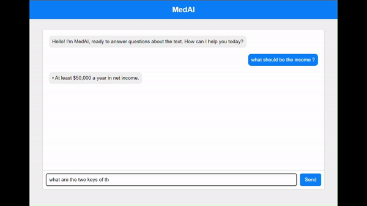

# MedAI Chatbot



**MedAI Chatbot** is an intelligent medical assistant designed to provide basic assistance for medical illnesses and health-related queries. This chatbot leverages **natural language processing (NLP)** and **machine learning** to offer tailored responses, helping users make sense of medical conditions.

### Features:
- **Medical Assistance**: Get insights on various health issues by asking questions in natural language.
- **Customizable Data**: You can feed the chatbot your own medical datasets or specific information, allowing it to generate responses that meet your unique needs.
- **Integrated with GPT-2**: The chatbot is enhanced with **GPT-2** to provide well-structured, clear, and human-like responses for an improved conversational experience.

### How It Works:
1. **Query the Chatbot**: Type your health or medical question into the chatbot interface.
2. **Receive Response**: The chatbot processes your question using its NLP and machine learning capabilities to find the most relevant information.
3. **Custom Data**: You can upload your own medical texts, datasets, or relevant materials, and the chatbot will adjust its responses accordingly.
4. **GPT-2 Integration**: GPT-2 is used to ensure that responses are not only accurate but also coherent and professionally structured.

### Installation

1. **Clone the Repository**:
    ```bash
    git clone https://github.com/Akash-9070/MedAI-Chatbot.git
    cd MedAI-Chatbot
    ```

2. **Install Dependencies**:
    Ensure you have Python installed, then run:
    ```bash
    pip install -r requirements.txt
    ```

3. **Run the Application**:
    ```bash
    python app.py
    ```
   Navigate to `http://localhost:5000` to interact with the chatbot.

### How to Customize:

1. **Replace the default medical text** with your own text file in the `all_text_file/` directory, ensuring that your custom dataset fits your requirements.
2. **Train with new data**: Modify the training process to integrate your data to suit specific use cases or to focus on different medical fields.

### Usage:

- Enter your medical-related query, and the chatbot will respond with relevant information based on the data it was trained on.
- If you've integrated custom data, it will use that information to generate responses.
- The chatbot automatically leverages GPT-2 to ensure responses are clear and properly formatted.

### Future Development:

- Expand the chatbot’s capabilities to support more advanced medical diagnosis systems.
- Integrate additional machine learning models to improve prediction accuracy.

### Contributions:

Feel free to contribute by raising issues, submitting pull requests, or suggesting features!
